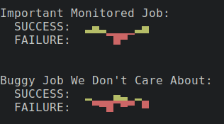

# spark-null

Tiny wrapper around [https://github.com/holman/spark](spark) which allows adding "n" to represent null values. This allows drawing graphs like:

    $ echo '6 1 4 n 4' | ./spark-null
    █▁▅ ▅

Instead of what normal `spark` will do:

    $ echo '6 1 4 0 4' | spark
    █▂▅▁▅

You can also use a `-0` switch to leave empty spaces where 0's are as well:

    $ echo '6 1 4 0 4' | spark-null -0
    █▁▅ ▅

This sometimes tells a more accurate story.

Because `spark-null` supports minimum and maximum values you can draw positive and negative graphs relatively easily.

    G1=$(echo "2 5 2 0 2 4" | ./spark-null -0 -m 0 -n 9)
    G2=$(echo "0 0 0 2 0 0" | ./spark-null -i -m 0 -n 9)
    echo -e "\e[32m${G1}\n\e[30;41m${G2}"

License: MIT
